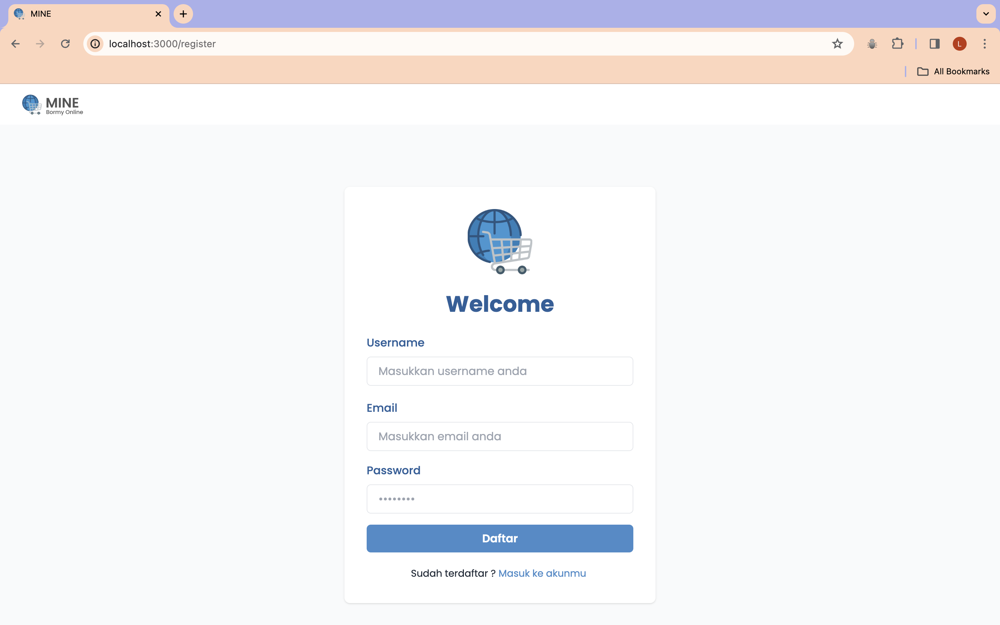
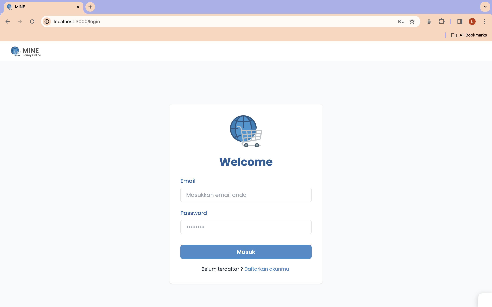
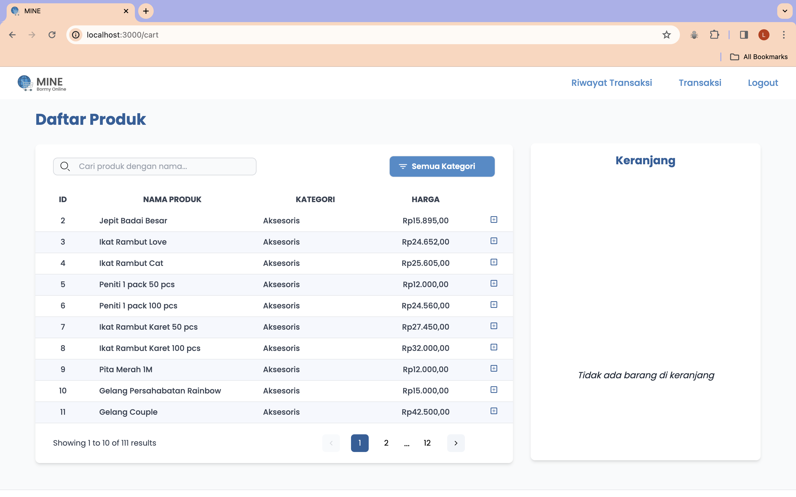

# MINE - Bormy Online

## Table of Contents
1. [General Information](#general-information)
2. [Use Case Implementation](#use-case)
3. [Capture Screen](#capture-screen)
4. [Tech Stack](#tech-stack)
5. [Setup](#setup)
6. [Usage](#usage)
7. [Database](#database)

<a name="general-information"></a>

## General Information
Bormy Online (MINE) adalah sebuah website sistem manajemen informasi point of sales yang akan membantu pemilik dalam melakukan pencatatan barang, melakukan transaksi penjualan, serta mencatat transaksi penjualan yang dilakukan di Bormy. Sistem akan dikelola oleh seorang admin yang akan mengatur hak akses dari setiap pegawai yang terbagi menjadi pegawai inventaris dan juga pegawai kasir. Sistem ini juga dapat menyajikan laporan hasil transaksi penjualan harian, mingguan,maupun bulanan serta riwayat daftar transaksi penjualan setiap pelanggan di Bormy

Website ini memiliki beberapa fitur, yaitu:
- Mengelola keranjang<br>
 Menambahkan atau mengurangi produk ke keranjang serta dapat menambahkan keranjang baru atau menghapus keranjang.
- Mencari produk <br>
Menghasilkan data produk berdasarkan masukan berupa keyword pencarian produk.
- Mengelola produk <br>
Mengelola (menambahkan, menghapus, atau memperbarui) data produk berdasarkan input yang diberikan.
- Mengelola akun <br>
Mengelola akun melalui masukan data akun pengguna menjadi format data username yang dapat digunakan pada modul lain.
- Mengelola transaksi <br>
Mengelola transaksi berdasarkan data keranjang yang ingin dilanjutkan ke tahap pembayaran, serta terhubung otomatis dengan modul produk untuk penyesuaian jumlah stok produk.
- Mengelola Daftar Riwayat
Mengelola daftar riwayat transaksi berdasarkan data transaksi yang berhasil
.
<a name="use-case"></a>

## Use Case Implementation
| Nama                        | NIM      | Use Case                      
| --------------------------- | -------- | --------------------------- |
| Johan Christiansen          | 18221088 | - Melihat Daftar Hak Akses Pegawai                                    
|                             |          | - Mengelola Hak Akses Pegawai 
| Laurensia Audrey P          | 18221114 | - Register                  |
|                             |          | - Login                     |
| Miralistya Cahya F          | 18221116 | - Melihat daftar Barang     |
|                             |          | - Mengelola Inventaris      |
| Rania Sasi Kirana           | 18221168 | - Mengelola Keranjang       |
|                             |          | - Melihat Isi Keranjang     |
|                             |          | - Mengelola Riwayat Transaksi
| Minarti                     | 10023216 | -                            |

<a name="capture-screen"></a>

## Capture Screen

<p>
   <p>Gambar 1. Landing Page</p>
   
   <nl>
   <p>Gambar 2. Register</p>
   
   <nl>
   <p>Gambar 3. Login</p>
   
   <nl>
   <p>Gambar 4. Daftar Hak Akses</p>
   
   <nl>
   <p>Gambar 5. Pengelolaan Hak Akses</p>
   
   <nl>
   <p>Gambar 6. Daftar Produk</p>
   
   <nl>
   <p>Gambar 7. Pengelolaan Inventaris</p>
   
   <nl>
   <p>Gambar 8. Isi Keranjang</p>
   
   <nl>
   <p>Gambar 9. Pengelolaan Keranjang</p>
   
   <nl>
</p>

<a name="tech-stack"></a>

## Tech Stack
1. Next.js
2. React Typescript

<a name="setup"></a>

## Setup
1. Clone Repository ini dengan menggunakan command berikut
   ```sh
   git clone https://gitlab.informatika.org/k2_g10/if3152-2023-k02-g10-mine.git
   ```
2. Buka Folder "if3152-2023-k02-g10-mine" di Terminal
3. Install Packages yang diperlukan
   ```sh
   npm i
   ```
4. Jalanakan Aplikasi dengan menggunakan command
   ```sh
   npm run dev
   ```
5. Buka [http://localhost:3000](http://localhost:3000) pada Browser Anda

<a name="usage"></a>

## Usage
1. Masukkan email dan password untuk `login` ke aplikasi
2. Apabila akun belum terdaftar, klik `"Daftarkan akunmu"` dan masukkan username, email, dan password 
3. Anda akan masuk ke halaman sesuai role akun Anda
4. - User dengan role admin akan diarahkan ke halaman `Daftar Akun`
   - User dengan role kasir akan diarahkan ke halaman `Keranjang` dan `Daftar Riwayat Transaksi`
   - User dengan role inventaris akan diarahkan ke halaman `Daftar Produk`
5. User hanya dapat mengakses halaman sesuai dengan role nya masing-masing.
6. Tekan tombol `"Logout"` pada navbar untuk keluar dari akun

<a name="database"></a>

## Database
### account
| username  | password  |  role  |  email    

### category
|  idcategory  |  categoryname  |

### orders
|  idtransaction  | productname  |  quantity  |  price

### product
|  idproduct  |  productname  |  category  | price  |  stock

### transaction
|  idtransaction  |  username  |  transactiondate  |  totalcost

